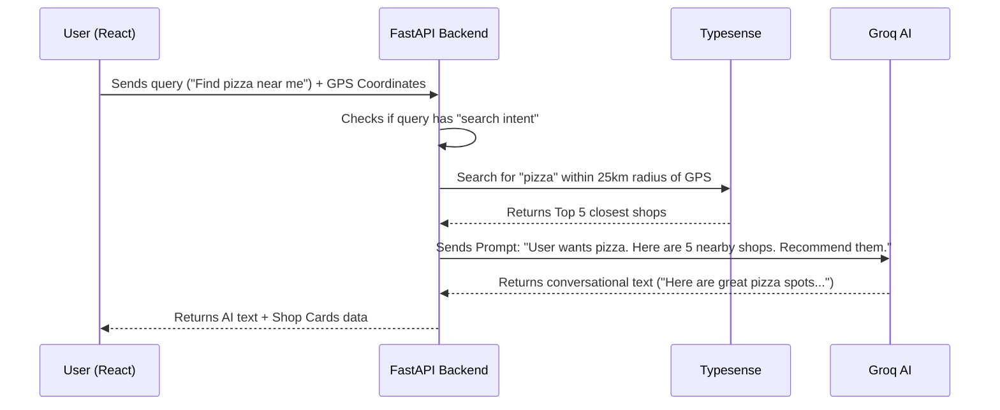

# Shop Chatbot: Complete Project Breakdown

This document is your master guide. It is written so you can easily understand the project and explain it confidently to your peers, recruiters, or senior developers.

---

## 1. What does this project do? (The "Elevator Pitch")
**In simple terms:** It is a smart, AI-powered search engine and chat assistant for finding local shops, restaurants, and services. 

Instead of just typing "Pizza" into a standard search bar, a user can say, *"I'm looking for a good pizza place near me with discounts."* 
The app grabs the user's GPS location, searches a high-speed database (Typesense) for nearby shops within a specific radius, and then feeds those results to an AI (Llama 3 via Groq). The AI responds conversationally, explaining exactly *why* those specific shops match the user's needs.

**As a Laravel Feature:** When integrated into your Laravel app, this acts as the "Smart Search / Chat Interface". Your Laravel app will manage the shops and user accounts, while this Python backend handles the heavy lifting of AI processing and location-based searching.

---

## 2. The Tech Stack (What we used and why)

*   **Frontend: React + Vite + Tailwind CSS**
    *   *Why?* React creates a snappy, single-page application feel without reloading. Tailwind makes styling fast and responsive. Vite is just a super-fast bundler.
*   **Backend API: Python + FastAPI**
    *   *Why?* FastAPI is incredibly fast because it handles asynchronous operations natively. Python is the best language for AI integrations.
*   **Database (Primary): MySQL (managed by Laravel)**
    *   *Why?* It's the standard, reliable relational database where all your shop data permanently lives.
*   **Search Engine (Secondary DB): Typesense**
    *   *Why?* MySQL is terrible at calculating GPS distances (e.g., "Find shops within 5km"). Typesense is an open-source, lightning-fast search engine built specifically for typos, filtering, and geographic coordinates.
*   **AI Engine: Groq (using Llama 3 Model)**
    *   *Why?* Groq uses specialized hardware (LPUs) that makes AI text generation nearly instant. This prevents the user from waiting 10 seconds for the chatbot to reply.

---

## 3. How the Data Flows (The Architecture)

Here is a diagram showing what happens when a user sends a message.

---

## 4. The Database Schema (MySQL)

Since this runs alongside your Laravel app, the data lives in MySQL. Here are the core tables and how they connect:

1.  **`categories` & `subcategories`**
    *   Stores the types of shops (e.g., Category: "Food", Subcategory: "Pizza").
2.  **`shop_details`**
    *   The core table. Contains `id`, `name`, `status`, `phone`, `shoplogo`, and foreign keys to the categories.
3.  **`shop_address`**
    *   Linked to `shop_details`. Contains `city`, `arearoadname`, and crucially, the `latitude` and `longitude`.
4.  **`typesense_sync_queue` (The "Magic" Table)**
    *   *How it works:* We created **MySQL Triggers**. Whenever a shop is updated, created, or deleted in Laravel, the trigger automatically drops a row into this queue table. A background job in Python reads this queue every minute and pushes the updates to Typesense. This ensures Typesense is always perfectly in sync with MySQL.

---

## 5. Advantages of this Architecture

If a senior asks you *"Why did you build it this way?"*, here are your answers:

*   **Decoupled Search:** By separating MySQL (Source of Truth) from Typesense (Search Engine), heavy user searches don't slow down the main Laravel website.
*   **Blazing Fast AI:** Using Groq instead of OpenAI/ChatGPT makes the chat feel real-time.
*   **Smart Fallbacks:** The app routes queries smartly. If a user says "Hello", it chats normally. If they say "Find coffee", it knows to hit the Typesense search engine first.
*   **Auto-Syncing:** The MySQL trigger system guarantees that if a shop owner updates their address in Laravel, it automatically updates in the search engine without writing messy sync code in the application layer.

---

## 6. Disadvantages & Trade-offs

*   **Infrastructure Complexity:** You now have to manage a MySQL database, a Redis cache, a Typesense server, and a Python server, alongside your Laravel PHP server.
*   **Eventual Consistency:** When a shop is updated in Laravel, there is a slight delay (up to 1 minute) before it shows up in the chatbot search because of the background queue processor.

---

## 7. Problems While Scaling (And How to Solve Them)

As a fresher, pointing out how the app might break under heavy load shows senior-level thinking.

1.  **Problem: The Python MySQL Driver**
    *   *The Issue:* The code currently uses `mysql.connector` wrapped in `run_in_executor`. Under massive load (thousands of requests per second), this thread-pool approach will bottleneck and freeze up FastAPI.
    *   *The Solution:* We must switch to a native asynchronous database driver like `aiomysql` or `asyncmy` before serving massive traffic.
2.  **Problem: Rate Limiting the AI**
    *   *The Issue:* Groq API costs money/has limits. A malicious user could spam the chat endpoint and exhaust your API limits.
    *   *The Solution:* We are using `slowapi` to limit requests (e.g., 30 per minute per IP), but in production, we should tie rate limits to authenticated User IDs, not just IP addresses.
3.  **Problem: The Sync Queue Bottleneck**
    *   *The Issue:* If someone bulk-imports 100,000 shops into Laravel, the `typesense_sync_queue` table will get huge, and processing it row-by-row in Python will take hours.
    *   *The Solution:* The background job must be upgraded to read the queue in "batches" and use Typesense's `/import` endpoint for bulk uploading, rather than syncing one shop at a time.
